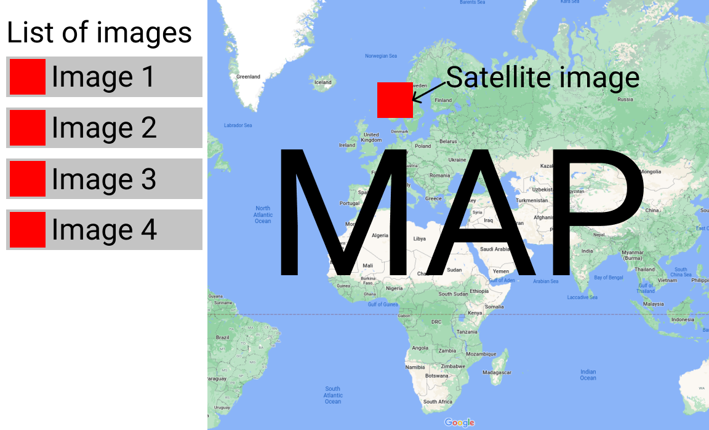

# Front-End Challenge Project

## Expected output
The output must be a private fork of this project and a working deployment on a free hosting platform. You must invite the Github users anagha-br, Gramof0n, AlbertWigmore, mrob95, JakeRandellOC, and pepjo as Collaborators on the project.

The fork must include all the necessary source code, dependencies files (such as package.json), this **unmodified** README.md file, and a [CONCLUSIONS.md](./CONCLUSIONS.md) file. The CONCLUSIONS.md contains a description of what it should contain.

The project must be completed in any framework supported by Astro (Astro templates, AlpineJS, Lit, Preact, React, SolidJS, Svelte, or Vue) and TypeScript. You can use `npx astro add <framework>` in order to add your preferred framework, as explained in the [Astro docs](https://docs.astro.build/en/guides/integrations-guide/). Any public NPM package can be added to the project.

## Submission

When you complete all your tasks or your time reaches the end, please submit the following [completion form](https://forms.gle/MQxaFd1s2DS2qqiC8). We expect most candidates to not be able to complete all tasks, please submit your incomplete project if you have not completed in the allocated time.

The time of the submission for both form (start and end) is stored. 

We recommend you ensure the project is deploying correctly from the start, as that will be required for the submission.

## Evaluation criteria
- The GitHub pages deployment works correctly. We encourage you to check before the submission time that everything works as expected to prevent last minute issues. 
- Both the code as well as the UI / UX design will be evaluated. In terms of design, UX will be evaluated more heavily.
- The code must be written to what you consider a good *production standard*.
- The quality of the code is considered more important than the number of features.

## Project description
To complete the project you will be provided with a list of satellite images, a title, and their [bounding box](#earth-coordinate-systems-and-bounding-box). You can decide to hardcode the JSON metadata in public/images/metadata.json directly in the app, there is no need to fetch it from the client.

The project is a satellite image visualisation solution. It must include a way to visualise a list of the images on a list as well as on an Earth map. When the images are displayed on the map they must be shown in the right earth position as indicated by its bounding box.

Following agile practices, the project is described from the user point of view. The following user stories are required:
- As a user, I want the application to load fast and feel responsive.
- As a user, I want to be able to see a list of all the available images.
- As a user, I want to be able to select (and unselect) certain images to be displayed on the map.
- As a user, I want to be able to see a preview of the image on the list. Even before they are selected to be displayed on the map.

### Current project

The project has already been initialised with the default Astro template and Github Actions for deployment into Github Pages.

#### Project Structure

Inside of your Astro project, you'll see the following folders and files:

```text
/
├── public/
│   └── favicon.svg
├── src/
│   ├── components/
│   │   └── Card.astro
│   ├── layouts/
│   │   └── Layout.astro
│   └── pages/
│       └── index.astro
└── package.json
```

Astro looks for `.astro` or `.md` files in the `src/pages/` directory. Each page is exposed as a route based on its file name.

There's nothing special about `src/components/`, but that's where we like to put any Astro/React/Vue/Svelte/Preact components.

Any static assets, like images, can be placed in the `public/` directory.

#### Commands

All commands are run from the root of the project, from a terminal:

| Command                   | Action                                           |
| :------------------------ | :----------------------------------------------- |
| `npm install`             | Installs dependencies                            |
| `npm run dev`             | Starts local dev server at `localhost:4321`      |
| `npm run build`           | Build your production site to `./dist/`          |
| `npm run preview`         | Preview your build locally, before deploying     |
| `npm run astro ...`       | Run CLI commands like `astro add`, `astro check` |
| `npm run astro -- --help` | Get help using the Astro CLI                     |


### Example layout

A concept layout mockup is included. **Please note that the mockup is only used to illustrate a possible layout, candidates can change the layout as long as the user story is met**. The candidate must find a solution with a great user experience and, to the extent possible, good and simple design.



### Earth coordinate systems and bounding box

There are many Earth coordinate systems and reference systems. The images and metadata provided as part of this exercise use the WGS84 datum.

A bounding box is the smallest rectangular space aligned with the reference system that contains an image. For each image and coordinate system only one bounding box exists. Knowing the bounding box is useful to place and scale the image correctly on the world map.


```
Example bounding box
[
    -1.7461121082,
    50.8862067121,
    1.7475402355,
    52.2652787311
]
```

A bounding box consists of 4 numbers, each of them is used to determine the position of one of the box sides. The image above is a representation of the bounding box above. The first number of the bounding box is used to determine the longitude of the left side (marked as 1 in the image). The second number is used to determine the latitude of the bottom side (marked as 2), the third is the longitude of the right side (marked as 3), and the last number is the latitude of the top side (marked as 4).

While it is interesting to understand, most mapping libraries do all the necessary processing of the bounding boxes to position an image.

### Useful resources

There are many map front-ends currently available with the features required to complete this task. A list of possible map libraries is provided, please do not feel limited by this list, any solution that meets the project description is good.

- [Leaflet](https://leafletjs.com/)
- [Mapbox GL](https://docs.mapbox.com/mapbox-gl-js/api/) (might require a Mapbox account)
- [Google Maps](https://developers.google.com/maps/documentation) (might require a Google account with billing enabled)
- [Bing Maps](https://www.bingmapsportal.com/) (might require a Microsoft account)
- [Cesium](https://cesium.com/)

In addition, if you are unfamiliar with this tools, you might want to check:

- [Astro Docs](https://docs.astro.build/)
- [Github Actions](https://docs.github.com/en/actions)
- [Github Pages](https://docs.github.com/en/pages)

